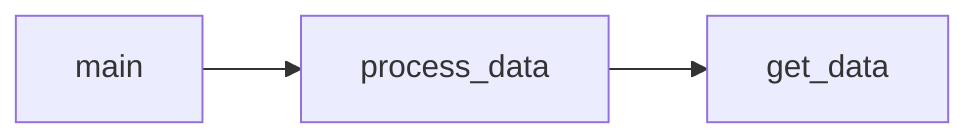

# RFM analysis and Customer Segmentation
### Overview
We calculate recency, frequency, and monetary values, assign scores, and segment customers into predefined categories such as "high value customers".

The analysis is based on customer transactional data with columns ```CustomerID```, ```InvoiceDate```, ```Quantity``` and ```UnitPrice```

### Dependencies
The required packages are included in file ```requirements.txt```<br>
Python interpreter version used for this project: **3.9.4**

Below is the code diagram displaying the relationships between its modules:

