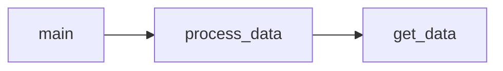

# RFM analysis and Customer Segmentation
### Overview
We implement RFM analysis in order to segment customers based on past purchase behavior.
The analysis is based on customer transactional data with columns ```CustomerID```, ```InvoiceDate```, ```Quantity``` and ```UnitPrice```.

Based on the data we calculate the following features per customer:
- recency (R) - time since last purchase
- frequency (F) - total number of purcharses
- monetary value (M) - total spent

Predefined categories such as "high value customer" are assigned to each customer according to his RFM score.

### Dependencies
The required packages are included in file ```requirements.txt```<br>
Python interpreter version used for this project: **3.9.4**

Below is the code diagram displaying the relationships between its modules:

