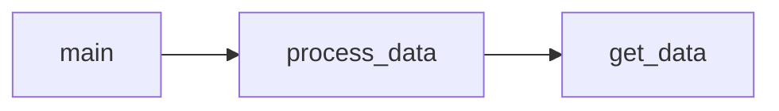

# RFM analysis and Customer Segmentation
### Overview
We implement RFM analysis segment customers based on past purchase behavior, using the following features:
- recency (R) - time since last purchase
- frequency (F) - total number of purcharses and
- monetary value (M) - total spent

Each customer is assigned into predefined categories such as "high value customers" according to his RFM score.

The analysis is based on customer transactional data with columns ```CustomerID```, ```InvoiceDate```, ```Quantity``` and ```UnitPrice```

### Dependencies
The required packages are included in file ```requirements.txt```<br>
Python interpreter version used for this project: **3.9.4**

Below is the code diagram displaying the relationships between its modules:

