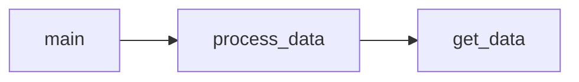

# Customer Segmentation via RFM analysis
### Overview
We implement RFM analysis in order to segment customers based on past purchase behavior.
We utilize customer transactional data with columns ```CustomerID```, ```InvoiceDate```, ```Quantity``` and ```UnitPrice```.

Here are the steps of our method:

1. Based on the data we calculate the following features per customer:
    - recency (R) - time since last purchase
    - frequency (F) - total number of purcharses
    - monetary value (M) - total spent

2. Calculate customer RFM score, as in:
<p align="center">
$RFM = R + F + M$
</p>

3. Assign predefined categories such as "high value customer" to each customer according to his RFM score. In our implementation if $RFM \geq 8$ then the customer is considered as "high value customer".

### Dependencies
The required packages are included in file ```requirements.txt```<br>
Python interpreter version used for this project: **3.9.4**

Below is the code diagram displaying the relationships between its modules:

