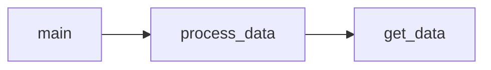

# Customer Segmentation via RFM analysis
### Overview
We implement [RFM analysis](https://en.wikipedia.org/wiki/RFM_(market_research)) in order to segment customers based on past purchase behavior.
We utilize customer transactional data with columns ```CustomerID```, ```InvoiceDate```, ```Quantity``` and ```UnitPrice```.

### Method
Here are the steps of our method:
1. Calculate the following features per customer:
    - recency (R) - time since last purchase
    - frequency (F) - total number of purcharses
    - monetary value (M) - total spent

2. Calculate customer RFM score, as in:
<p align="center">
$RFM = R + F + M$
</p>

3. Define rules to assign customer segments to customers, based on RFM score. <br> In our implementation:
<p align="center">
if $customer_i$ has $RFM_i \geq 8$ then $segment_i$ = "high value customer"
</p>

4. Assign customer segments to each customer. 

### Code structure
Following are descriptions of the python modules used in the code:

- ```main.py```: defines the RFM threshold above which a customer is characterized as 'high value', calls module ```process_data.py```
- ```process_data.py```: calculates R, F and M per customer, calls module ```get_data.py```
- ```get_data.py```: gets data

Below is the code diagram displaying the relationships between its modules:


### Dependencies
The required packages are included in file ```requirements.txt```<br>
Python interpreter version used for this project: **3.9.4**
